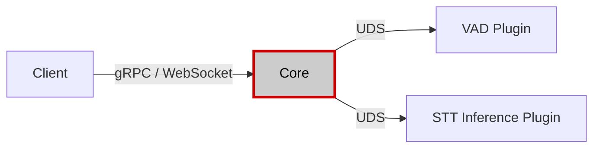
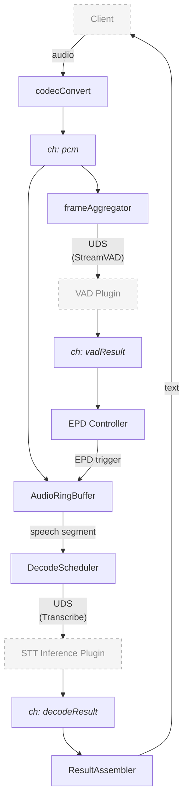
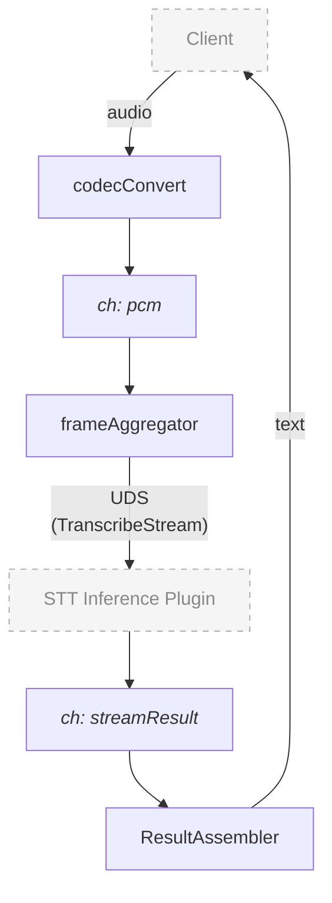

# speechmux/core

Go-based central service that handles gRPC/WebSocket transport, session lifecycle, audio pipeline, end-of-speech detection (EPD), decode scheduling, plugin routing, and observability.

## Architecture



Per-session pipeline — **batch engine** (e.g. mlx-whisper): VAD drives utterance boundaries; Core extracts segments and sends each as a single Transcribe RPC:



Per-session pipeline — **streaming engine** (e.g. sherpa-onnx): VAD and ring buffer are bypassed; audio flows directly to the STT plugin which manages its own utterance boundaries:



## Internal Packages

| Package | Purpose |
|---------|---------|
| `cmd/speechmux-core` | Binary entry point |
| `internal/config` | YAML loading with `atomic.Pointer[Config]` for hot-reload |
| `internal/runtime` | `errgroup`-based application lifecycle, graceful shutdown |
| `internal/session` | Session CRUD, auth (API key / signed token), park/resume, idle checker |
| `internal/transport` | gRPC (`StreamingRecognize`), HTTP (`/health`, `/metrics`, `/admin`), WebSocket bridge |
| `internal/plugin` | Plugin gRPC clients (`InferenceClient` unary, `InferenceStreamClient` bidi-stream), circuit breaker (CLOSED→OPEN→HALF_OPEN→CLOSED), `PluginRouter` |
| `internal/stream` | Pipeline: `AudioRingBuffer`, `frameAggregator`, `EPDController`, `DecodeScheduler`, `ResultAssembler`; `StreamingEngine` (native-streaming path), `BatchEngine` (unary path) |
| `internal/codec` | Audio conversion (PCM S16LE, A-law, mu-law, WAV) with resampling |
| `internal/storage` | Async session audio recording to disk |
| `internal/errors` | `ERR####` code definitions, gRPC/HTTP status mappings, `PluginErrorCode` translation |
| `internal/metrics` | Prometheus `MetricsObserver` interface + implementations |
| `internal/health` | Health check types (shared between transport and runtime) |
| `internal/tracing` | OpenTelemetry OTLP/gRPC init (noop TracerProvider when endpoint is empty) |
| `internal/ratelimit` | Per-IP and per-API-key token bucket rate limiting |
| `internal/ctl` | `speechmux-ctl` subcommand: embedded process manager (start/stop/status) |
| `tools/loadtest` | gRPC load test (concurrent sessions, latency percentiles) |

## Prerequisites

- Go 1.22+
- `golangci-lint` — optional, for static analysis (`brew install golangci-lint`)

## Build

```bash
go build -o bin/speechmux-core ./cmd/speechmux-core
```

## Run

```bash
# Standalone (plugins must be started separately)
./bin/speechmux-core --config config/core.yaml --plugins config/plugins.yaml

# With embedded process manager
./bin/speechmux-core ctl start --config config/core.yaml --plugins config/plugins.yaml
./bin/speechmux-core ctl status
./bin/speechmux-core ctl stop
```

## Test

```bash
go test -race ./...
go vet ./...
```

## Load Test

```bash
# 1. Build core and loadtest
make build

# 2. Start dummy plugins + core (from workspace root)
make -C .. run-dummy

# 3. Run load test
./bin/loadtest --sessions 100 --duration 5m
```

## Configuration

### core.yaml

| Section | Key Settings |
|---------|-------------|
| `server` | `grpc_port` (50051), `http_port` (8090), `ws_port` (8091), `max_sessions` (1000), `session_timeout_sec` (60), `shutdown_drain_sec` (30), `resumable_session_timeout_sec` (0), `allowed_origins` ([]), `http_read_timeout_sec` (10), `http_write_timeout_sec` (10), `http_idle_timeout_sec` (60), `http_shutdown_timeout_sec` (5) |
| `stream` | `vad_silence_sec` (0.5), `vad_threshold` (0.5), `speech_rms_threshold` (0.02), `partial_decode_interval_sec` (1.5), `partial_decode_window_sec` (10.0), `decode_timeout_sec` (30), `max_buffer_sec` (20), `buffer_overlap_sec` (0.5), `emit_final_on_vad` (false), `vad_frame_timeout_sec` (3), `epd_heartbeat_interval_sec` (30) |
| `codec` | `target_sample_rate` (16000 Hz) |
| `rate_limit` | `create_session_rps`, `create_session_burst`, `max_sessions_per_ip`, `max_sessions_per_api_key`, `http_rps`, `http_burst` |
| `auth` | `require_api_key`, `auth_profile` (none / api_key / signed_token), `auth_secret`, `auth_ttl_sec` |
| `tls` | `tls_required`, `cert_file`, `key_file` |
| `otel` | `endpoint` (OTLP gRPC target), `service_name`, `sample_rate` |
| `storage` | `enabled`, `directory` |
| `logging` | `level` (debug / info / warn / error) |
| `decode_profiles` | Named sets: `realtime` (beam=1, greedy) / `accurate` (beam=5) |

### plugins.yaml

```yaml
vad:
  endpoints:
    - id: "vad-0"
      socket: "/tmp/speechmux/vad.sock"
  health_check_interval_sec: 10
  circuit_breaker:
    failure_threshold: 5
    half_open_timeout_sec: 30

inference:
  routing_mode: "least_connections"  # round_robin | least_connections | active_standby
  endpoints:
    - id: "whisper-mlx"
      socket: "/tmp/speechmux/stt-mlx.sock"
      priority: 1
    - id: "sherpa-onnx"
      socket: "/tmp/speechmux/stt-sherpa.sock"
      priority: 1
  health_check_interval_sec: 10
  health_probe_timeout_sec: 5
  circuit_breaker:
    failure_threshold: 5
    half_open_timeout_sec: 30
```

### Config Hot-Reload

Send `SIGHUP` or `POST /admin/reload` to trigger reload.

| Applied to | Settings |
|-----------|----------|
| Existing sessions immediately | `vad_silence_sec`, `vad_threshold`, `decode_timeout_sec`, `speech_rms_threshold`, `epd_heartbeat_interval_sec`, `emit_final_on_vad`, `buffer_overlap_sec`, `partial_decode_window_sec`, `vad_frame_timeout_sec` |
| New sessions only | `max_sessions`, `auth_*`, `codec.*`, `rate_limit.*`, `decode_profiles.*` |
| Requires restart | `grpc_port`, `http_port`, `ws_port`, `tls.*`, `logging.level` |
| Dynamic (Admin API) | Plugin endpoints via `POST /admin/plugins` |

## Session Lifecycle

### Normal Flow

1. Client connects (gRPC or WebSocket)
2. First message: `SessionConfig` → validate, auth, rate-limit, negotiate
3. Session created, 6-goroutine pipeline started
4. Audio → codec → VAD → EPD → decode → result → client
5. Client sends `is_last` signal → final result → stream closes

### WebSocket Park-and-Resume

When `resumable_session_timeout_sec > 0` and a WebSocket disconnects unexpectedly:

1. Session is parked (pipeline stays alive, results buffer up to 16 entries)
2. Park timer starts (fires `CloseSession` after timeout)
3. Client reconnects: `{"type":"resume","session_id":"...","resume_token":"..."}`
4. Token validated, park timer stopped, new send/recv loops attach to existing session

### Idle Session Timeout

When `session_timeout_sec > 0`, a background goroutine periodically checks for sessions with no audio activity exceeding the timeout. Parked sessions are excluded (managed by their own park timer).

### Graceful Shutdown

1. **SIGTERM**: stop accepting new streams, set `/health` to `draining`
2. **Drain** (`shutdown_drain_sec`): let active sessions finish current utterance
3. **Force close**: terminate remaining sessions with ERR1013

## EPD Algorithm

1. VAD Plugin reports `is_speech` + `speech_probability` per frame (echoing `sequence_number`)
2. `AdvanceWatermark()` updates the ring buffer's confirmed boundary
3. Speech→silence transition starts a silence timer (`vad_silence_sec`)
4. Silence exceeds threshold → `ExtractRange(speechStartSeq, silenceEndSeq)` extracts audio
5. Audio segment dispatched to `DecodeScheduler`
6. **Silent Hang defense**: if no VAD response for 3 seconds, session terminates with ERR3004

## Decode Scheduling

- **Global semaphore**: bounds total in-flight decodes across all sessions
- **Final decodes**: block up to 5s for a slot (ERR2008 on timeout)
- **Partial decodes**: non-blocking drop when queue is full
- **Per-request timeout**: `decode_timeout_sec` (default 30s, ERR2001 on expiry)
- **Adaptive partial intervals**: 1.5s (<5s audio) → 3.0s (5–10s) → 5.0s (>10s)

## Plugin Routing

- **Session binding**: once assigned, a session stays on the same endpoint
- **Engine hint**: `engine_hint` in `SessionConfig` pins a session to a named endpoint via `PinByHint`; falls back to normal routing if the endpoint is unavailable
- **Circuit breaker**: CLOSED → OPEN (N failures) → HALF_OPEN (probe) → CLOSED
- **Health tracking**: rolling window of success/timeout/error events per endpoint
- **Dynamic registration**: `POST /admin/plugins` to add/remove endpoints at runtime

## Observability

### HTTP Endpoints

| Endpoint | Purpose |
|----------|---------|
| `GET /health` | Liveness probe (returns `ok` or `draining`) |
| `GET /metrics` | Prometheus text format |
| `GET /metrics.json` | JSON format metrics |

### Key Metrics

**Batch engine (unary Transcribe)**
- `speechmux_active_sessions` — current session count (gauge)
- `speechmux_sessions_total` — cumulative sessions opened (counter)
- `speechmux_decode_latency_seconds` — inference latency histogram (labels: `type`, `engine`)
- `speechmux_decode_requests_total` — decode count with success/failure (labels: `type`, `ok`, `engine`)
- `speechmux_vad_triggers_total` — EPD trigger counter
- `speechmux_vad_watermark_lag_total` — ring buffer watermark lag events

**Streaming engine (TranscribeStream)**
- `speechmux_streaming_sessions_active` — active streaming sessions (gauge, label: `engine`)
- `speechmux_streaming_partial_latency_seconds` — partial hypothesis latency histogram (label: `engine`)
- `speechmux_streaming_finalize_latency_seconds` — final utterance latency histogram (label: `engine`)
- `speechmux_streaming_session_terminations_total` — session close reasons (labels: `engine`, `reason`)
- `speechmux_engine_response_timeout_total` — engine response timeout counter (label: `engine`)

### Distributed Tracing (OpenTelemetry)

When `otel.endpoint` is set, Core exports spans via OTLP/gRPC:

```
session.pipeline                        (ProcessSession)
  └─ stt.decode × N                    (DecodeScheduler.Submit)
       attributes: session.id, is_final, is_partial, audio_sec
```

Empty endpoint (default) installs a noop TracerProvider with zero overhead.

## TLS Configuration

```yaml
tls:
  tls_required: true
  cert_file: /path/to/cert.pem
  key_file: /path/to/key.pem
```

### Generating Certificates

**Self-signed (local development)**:

```bash
openssl req -x509 -newkey ec -pkeyopt ec_paramgen_curve:P-256 \
  -keyout key.pem -out cert.pem -days 365 -nodes \
  -subj "/CN=localhost" \
  -addext "subjectAltName=IP:127.0.0.1,DNS:localhost"
```

**Browser-trusted (mkcert)** — recommended for `client-web` since `getUserMedia` requires trusted HTTPS:

```bash
brew install mkcert
mkcert -install
mkcert localhost 127.0.0.1
```

**Production (Let's Encrypt)**:

```bash
certbot certonly --standalone -d your.domain.com
```

Note: certificate rotation requires a process restart.

## Error Codes

| Range | Category | Examples |
|-------|----------|----------|
| `ERR1xxx` | Client errors | ERR1001 missing session_id, ERR1004 unauthenticated, ERR1012 rate limited |
| `ERR2xxx` | Decode pipeline | ERR2001 decode timeout, ERR2005 all plugins unavailable, ERR2008 queue full |
| `ERR3xxx` | Internal errors | ERR3003 codec failure, ERR3004 VAD stream failure, ERR3005 buffer overflow |
| `ERR4xxx` | Admin/HTTP | ERR4001 admin disabled, ERR4004 invalid admin token |

## Code Reading Order

For contributors navigating the codebase for the first time, read files in this order:

**1. Startup**
- `cmd/speechmux-core/main.go` — binary entry point
- `internal/runtime/application.go` — component assembly, graceful shutdown
- `internal/config/config.go` + `loader.go` — YAML loading

**2. Request reception**
- `internal/transport/grpc_server.go` — `StreamingRecognize` handler, first-message parsing
- `internal/session/auth.go` — API key / signed token validation
- `internal/session/manager.go` + `session.go` — session creation and lifecycle

**3. Audio pipeline (core logic)**
- `internal/stream/processor.go` — per-session main loop; orchestrates everything below
- `internal/stream/audio_buffer.go` — `AudioRingBuffer` (Append / Trim / ExtractRange)
- `internal/stream/frame_aggregator.go` — batches audio into `optimal_frame_ms` chunks before VAD
- `internal/plugin/vad_client.go` — `StreamVAD` bidi-stream to VAD Plugin
- `internal/stream/epd_controller.go` — VAD results → speech/silence decision (EPD)
- `internal/stream/decode_scheduler.go` — STT request scheduling, semaphore, partial/final split
- `internal/plugin/router.go` + `endpoint.go` — STT endpoint routing, health-weighted selection, `PinByHint`
- `internal/plugin/inference_client.go` — `Transcribe` unary RPC (batch engines)
- `internal/plugin/inference_stream_client.go` — `TranscribeStream` bidi-stream (streaming engines)
- `internal/stream/streaming_engine.go` — per-session streaming engine goroutine loop
- `internal/stream/batch_engine.go` — per-utterance batch engine decode path

**4. Result assembly**
- `internal/stream/result_assembler.go` — builds `committed` + `unstable` transcript
- (back to `processor.go`) — sends result downstream to the client stream

**Reference (look up as needed)**
- `internal/errors/codes.go` — `ERR####` scheme and gRPC/HTTP mappings
- `internal/codec/converter.go` — audio format conversion
- `internal/ctl/` — plugin process supervisor
- `internal/metrics/` + `internal/tracing/` — observability

`processor.go` is the single most important file. Read it first in step 3, then follow references outward.

## License

MIT
